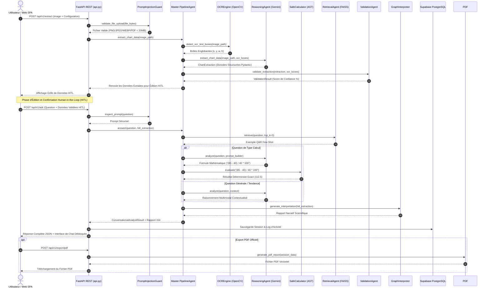

# 🏗 Manuel Spécificatif & Architecture Technique — GrapheinAI

**Projet** : GrapheinAI — SaaS Enterprise d'Intelligence Graphique Multimodale  
**Version du Système** : 5.0.0 Enterprise  
**Statut** : Production / SRE Ready  

---

## 📑 Table des Matières
1. [Vue d'Ensemble & Alignment Architectural](#1-vue-densemble--alignment-architectural)
2. [Matrice Exhaustive des Technologies & Bibliothèques](#2-matrice-exhaustive-des-technologies--bibliothèques)
3. [Architecture des Composants & Agents IA](#3-architecture-des-composants--agents-ia)
4. [Pipeline d'Exécution & Séquence Multi-Étapes](#4-pipeline-dexécution--séquence-multi-étapes)
5. [Sécurité Multi-Tenant & Modèle de Base de Données RLS](#5-sécurité-multi-tenant--modèle-de-base-de-données-rls)
6. [Observabilité, Caching & Performance SRE](#6-observabilité-caching--performance-sre)
7. [Éco-Conception & Sobriété Numérique (RGPD)](#7-éco-conception--sobriété-numérique-rgpd)

---

## 1. Vue d'Ensemble & Alignment Architectural

GrapheinAI repose sur un motif **Hexagonal (Ports & Adapters)** hautement découplé. L'application sépare rigoureusement :
- **La Couche d'Interface (Adapteurs Entrants)** : Interface Web SPA légère (Vanilla JS/CSS), Application Streamlit interactive, API REST FastAPI ASGI.
- **Le Cœur Métier & Moteur d'IA (Domain Core)** : Orchestrateur `PipelineAgent`, agents d'IA spécialisés, analyseur AST déterministe, moteurs de calculs statistiques et générateurs de rapports.
- **La Couche d'Infrastructure (Adapteurs Sortants)** : Persistence PostgreSQL Supabase avec Row Level Security (RLS), moteur de recherche vectoriel FAISS local, génération de documents PDF (ReportLab), services d'emails transactionnels (Resend).

### Diagramme d'Architecture Système (Mermaid)

```mermaid
graph TB
    subgraph Client Layer
        SPA[Frontend SPA HTML5 / Vanilla CSS]
        ST[Streamlit App / Cloud / HF Spaces]
    end

    subgraph Security & API Gateway Layer
        CORS[CORS Middleware]
        SecHeaders[Security Headers OWASP]
        Guard[PromptInjectionGuard]
        Auth[Supabase Auth & RLS Guard]
    end

    subgraph Application Core Services
        API[FastAPI REST Router]
        SessMgr[AnalysisSessionManager]
        Cache[CacheManager LRU & DiskCache]
        Queue[TaskQueueManager / Workers]
    end

    subgraph AI Pipeline Orchestration (PipelineAgent)
        Intent[QuestionIntentClassifier]
        OCR[OCREngine - OpenCV Bounding Boxes]
        Intelligence[ChartIntelligenceEngine]
        Reasoning[ReasoningAgent - Gemini Flash 1.5/3.5]
        AST[SafeCalculator AST Engine]
        RAG[RetrievalAgent - FAISS Vector DB]
        Validation[ValidationAgent]
        Interpreter[GraphInterpreter Agent]
        Recs[RecommendationEngine]
        XAI[ExplainabilityEngine]
    end

    subgraph External & Persistence Layer
        SupaDB[(Supabase PostgreSQL + RLS)]
        Logs[RotatingFileHandler Log Storage]
        PDF[PDFReportGenerator - ReportLab]
        Email[EmailService - Resend API]
    end

    SPA --> CORS
    ST --> PipelineAgent
    CORS --> SecHeaders
    SecHeaders --> Guard
    Guard --> Auth
    Auth --> API
    API --> SessMgr
    SessMgr --> Cache
    API --> PipelineAgent

    PipelineAgent --> Intent
    PipelineAgent --> OCR
    PipelineAgent --> Intelligence
    PipelineAgent --> Reasoning
    PipelineAgent --> AST
    PipelineAgent --> RAG
    PipelineAgent --> Validation
    PipelineAgent --> Interpreter
    PipelineAgent --> Recs
    PipelineAgent --> XAI

    Interpreter --> Recs
    API --> SupaDB
    API --> Logs
    API --> PDF
    API --> Email
```

---

## 2. Matrice Exhaustive des Technologies & Bibliothèques

Le tableau suivant présente **l'intégralité des technologies, frameworks et bibliothèques** intégrés dans GrapheinAI, leurs particularités majeures et leur utilité exacte dans le projet.

| Domaine / Catégorie | Technologie / Library | Particularités Techniques | Rôle & Utilité dans GrapheinAI |
| :--- | :--- | :--- | :--- |
| **Backend Core & API** | **FastAPI** `0.110.0+` | Framework Python ASGI haute performance basé sur Starlette et Pydantic. Validation automatique et documentation OpenAPI/Swagger. | Propose l'API REST de production (25+ endpoints), gère le routage asynchrone des requêtes d'analyse, l'authentification et les exports. |
| **Serveur ASGI** | **Uvicorn** `0.28.0+` | Serveur web ASGI ultra-rapide basé sur `uvloop` et `httptools`. | Exécute l'application FastAPI en production avec haute concurrence et gestion asynchrone des sockets. |
| **Validation & Typage** | **Pydantic** `2.6.0+` | Validation de données et gestion de paramètres basée sur le typage Python natif. Performance C via Rust core. | Définit et valide rigoureusement tous les modèles de données (graphiques, séries de points, profils utilisateurs, réponses XAI). |
| **Generative AI & VLM** | **Google GenAI / Gemini Flash 1.5 & 3.5** | Fenêtre de contexte de 1M+ tokens, traitement multimodal natif (images + texte), inférence sous-seconde. | Cœur du modèle de vision-langage (`ReasoningAgent`). Analyse l'image du graphique, extrait les séries textuelles et génère des raisonnements contextualisés. |
| **Vision par Ordinateur** | **OpenCV (`opencv-python-headless`)** | Bibliothèque C++ de traitement d'image haute vitesse. Version headless sans dépendances GUI X11. | Détection géométrique des contours, seuillage adaptatif, prétraitement des niveaux de gris et extraction des boîtes englobantes `[x,y,w,h]` des textes/axes. |
| **Traitement d'Image** | **Pillow (PIL)** `10.2.0+` | Bibliothèque standard de manipulation d'images Python. | Chargement, redimensionnement, conversion de formats (PNG/JPEG/WEBP/PDF) et découpage de sous-images (crop). |
| **Évaluation Sécurisée** | **Python `ast` (SafeCalculator)** | Module natif d'analyse d'Arbre Syntaxique Abstrait Python. Évaluation déterministe isolée. | Évalue les expressions mathématiques générées par l'IA de manière déterministe. **Élimine 100% des hallucinations de calcul** et bloque toute injection de code. |
| **Recherche Vectorielle** | **FAISS (`faiss-cpu`)** | Vector DB locale développée par Meta, optimisée pour la recherche de plus proches voisins (Similarity Search). | Stocke les embeddings de paires Q&R historiques et de règles sectorielles. Permet le RAG (Retrieval-Augmented Generation) en sous-milliseconde. |
| **Embeddings NLP** | **Sentence-Transformers** `2.2.0+` | Modèles de transformer pour le calcul d'embeddings denses de phrases et paragraphes (`all-MiniLM-L6-v2`). | Convertit les requêtes en vecteurs denses pour alimenter l'index vectoriel FAISS et effectuer des comparaisons sémantiques. |
| **Machine Learning** | **XGBoost & Scikit-Learn** | Algorithmes de Gradient Boosting et classification statistique supervisée. | `ClassifierAgent` : Classifie la complexité des questions (`SIMPLE` vs `COMPLEXE`) et prédit le type de graphique idéal pour router le traitement. |
| **Calculs Statistiques** | **NumPy & Pandas** | Calcul vectoriel C-optimized et manipulation de structures de données tabulaires (DataFrames). | `StatisticalEngine` & `AnomalyDetector` : Calculs exacts de moyennes, médianes, écarts-types, amplitudes, détection d'anomalies par score Z et IQR. |
| **Génération de PDF** | **ReportLab** `4.1.0+` | Moteur de génération de documents PDF vectoriels avec mise en page dynamique (Canvas/Flowables). | `pdf_generator.py` : Produit des rapports d'analyse officiels multi-pages d'entreprise (graphiques, tableaux, métriques XAI, recommandations). |
| **Export Excel** | **OpenPyXL & XlsxWriter** | Bibliothèques de création et manipulation de classeurs Excel `.xlsx` avec formats et formules. | Génère des fichiers Excel complets téléchargeables contenant les données brutes extraites et validées. |
| **Base de Données & RLS**| **Supabase Client (`supabase-py`)** | BaaS PostgreSQL avec moteur d'authentification et Row Level Security (RLS) natif. | Gère les identités utilisateurs (JWT), la persistance des sessions d'analyse, les espaces de travail collaboratifs (`workspaces`) et l'isolation multi-tenant. |
| **Framework Web UI** | **Streamlit** `1.32.0+` | Cadre d'application web rapide pour la Data Science et l'IA en Python natif. | Fournit une interface utilisateur interactive alternative (`streamlit_app.py`) utilisable sur Streamlit Community Cloud ou Hugging Face Spaces. |
| **Composants Streamlit**| **Streamlit-AgGrid** `1.0.5+` | Wrapper Streamlit pour la grille Ag-Grid Enterprise HTML/JS. | Grille d'édition interactive Human-in-the-Loop (HITL) permettant à l'utilisateur de modifier et valider les données graphiques extraites. |
| **Visualisation** | **Plotly & Altair** | Bibliothèques de visualisation de données interactives (WebGL / Vega-Lite). | Génère des graphiques interactifs dynamiques côté frontend dans l'application Streamlit. |
| **Emails Transactionnels**| **Resend SDK** `0.8.0+` | API de distribution d'emails transactionnels moderne avec forte livrabilité. | Envoie les emails de réinitialisation de mot de passe, les invitations aux espaces de travail et les alertes d'administration. |
| **Logging & Audit** | **Loguru** `0.7.2+` | Bibliothèque de logging structuré avec formatage automatique, rotation et rétention. | Enregistre tous les événements système, erreurs de pipeline et métriques d'audit dans des fichiers de logs tournants (`logs/app.log`). |
| **Caching & Résilience** | **DiskCache & Tenacity** | Caching persistant sur disque et gestion des tentatives de réessai avec retry/backoff exponentiel. | Cache les extractions VLM pour éviter des requêtes redondantes et sécurise les appels API réseau contre les coupures temporaires. |
| **Garde-Fou Sécurité** | **PromptInjectionGuard** | Moteur de règles Regex et vérification d'en-têtes de fichiers par "magic bytes". | Bloque les tentatives de jailbreak/injection de prompt et refuse le téléversement de fichiers malveillants ou corrompus. |
| **Internationalisation** | **LanguageManager (`langdetect`)** | Détection automatique de la langue des requêtes et dictionnaire de traductions fr/en. | Assure une expérience 100% bilingue (Français / Anglais) pour les réponses d'IA, les rapports PDF et l'interface. |
| **Tests & Qualité** | **Pytest, Ruff, Black** | Framework de tests unitaires/intégration, linter Rust ultra-rapide et formateur de code strict. | Maintient une suite de 28 fichiers de tests automatisés (180+ assertions) et garantit la qualité du code Python. |
| **Monitoring & SRE** | **Sentry SDK** `2.10.0+` | Plateforme de suivi d'erreurs et de monitoring de performance applicative en temps réel. | Intercepte les exceptions non capturées en production et fournit la traçabilité des stack traces. |

---

## 3. Architecture des Composants & Agents IA

### 3.1. Agents IA Spécialisés (`src/agents/`)

1. **`PipelineAgent` (`pipeline_agent.py`)** : Master Orchestrator. C'est le chef d'orchestre du système. Il reçoit la requête et l'image, coordonne la segmentation OCR, interroge Gemini VLM, applique le reconciliateur d'intelligence graphique, délègue les calculs à l'AST, consulte FAISS RAG, valide la confiance et assemble le résultat final (`ConversationalAnalystResult`).
2. **`ReasoningAgent` (`reasoning_agent.py`)** : Agent multimodal s'appuyant sur Gemini 1.5/3.5 Flash Vision. Il est alimenté par les boîtes englobantes OCR pour guider son attention visuelle et générer une extraction structurée des points de données.
3. **`SafeCalculator` (`safe_calculator.py`)** : Évaluateur déterministe d'expressions mathématiques. Il analyse le résultat de l'arbre syntaxique abstrait (`ast.parse`) et n'autorise que les opérations arithmétiques pures.
4. **`QuestionIntentClassifier` (`intent_classifier.py`)** : Moteur de classification de l'intention (`CALCULATION`, `STATISTICS`, `DATA_POINT`, `TREND`, `COMPARISON`, `GENERAL_ANALYSIS`).
5. **`ClassifierAgent` (`classifier_agent.py`)** : Classifier basé sur XGBoost/Règles déterminant la complexité de la question (`SIMPLE` vs `COMPLEXE`).
6. **`RetrievalAgent` (`retrieval_agent.py`)** : Agent de RAG s'appuyant sur l'index vectoriel FAISS pour injecter des exemples Few-Shot pertinents dans le prompt de raisonnement.
7. **`ValidationAgent` (`validation_agent.py`)** : Évalue la fiabilité des données extraites en croisant les coordonnées géométriques OpenCV et les valeurs VLM, et attribue un score de confiance globale.
8. **`GraphInterpreter` (`graph_interpreter.py`)** : Génère une synthèse narrative scientifique exhaustive (résumé, tendances majeures, extrema, corrélations).
9. **`InsightAgent` (`insight_agent.py`)** : Extrait les insights statistiques clés (variations en %, valeurs minimales/maximales, points de rupture).
10. **`RecommendationEngine` (`recommendation_engine.py`)** : Génère un copilote décisionnel (résumé exécutif, points d'attention, actions stratégiques) adapté au secteur et à l'expertise de l'utilisateur.
11. **`ExplainabilityEngine` (`explainability_engine.py`)** : Formule le rapport de transparence XAI (10 indicateurs de traçabilité).
12. **`MultiChartPipelineAgent` & `MultiChartFusion` (`multi_chart_pipeline.py`, `multi_chart_fusion.py`)** : Gère l'analyse de documents contenant plusieurs figures en isolant chaque graphique et en fusionnant les données dans une synthèse globale.

### 3.2. Utilitaires & Moteurs Core (`src/utils/`)

- **`OCREngine` (`ocr_engine.py`)** : Prétraitement d'image OpenCV (filtres, seuillage, contours) et détection des boîtes englobantes textuelles.
- **`ChartIntelligenceEngine` (`chart_intelligence_engine.py`)** : Fusionne et réconcilie la géométrie low-level d'OpenCV avec la vision sémantique de Gemini VLM.
- **`MultiChartDetector` (`multi_chart_detector.py`)** : Algorithme de détection hiérarchique des contours pour découper les planches multi-graphiques.
- **`PdfReportGenerator` (`pdf_generator.py`)** : Moteur ReportLab produisant des documents PDF vectoriels complets.
- **`PromptInjectionGuard` (`security_guard.py`)** : Filtrage des patterns malveillants (jailbreak, amnésie) et validation des fichiers (magic bytes, taille max 20MB).

---

## 4. Pipeline d'Exécution & Séquence Multi-Étapes

Le diagramme de séquence ci-dessous illustre le parcours d'une requête utilisateur depuis le téléversement jusqu'à la restitution du résultat d'analyse et de l'export PDF.



---

## 5. Sécurité Multi-Tenant & Modèle de Base de Données RLS

GrapheinAI s'appuie sur **Supabase PostgreSQL** avec des politiques de **Row Level Security (RLS)** natives. Chaque donnée (session d'analyse, membre d'espace de travail, journal d'activité) est strictement isolée au niveau de la base de données.

### 5.1. Schéma des Tables Principales (`supabase/schema.sql`)

```sql
-- 1. Table des Espaces de Travail (Workspaces)
CREATE TABLE public.workspaces (
    id UUID PRIMARY KEY DEFAULT gen_random_uuid(),
    name TEXT NOT NULL,
    owner_id UUID REFERENCES auth.users(id) ON DELETE CASCADE,
    created_at TIMESTAMPTZ DEFAULT now()
);

-- 2. Membres des Espaces de Travail (RBAC)
CREATE TABLE public.workspace_members (
    id UUID PRIMARY KEY DEFAULT gen_random_uuid(),
    workspace_id UUID REFERENCES public.workspaces(id) ON DELETE CASCADE,
    user_id UUID REFERENCES auth.users(id) ON DELETE CASCADE,
    role TEXT CHECK (role IN ('admin', 'analyst', 'viewer')),
    UNIQUE(workspace_id, user_id)
);

-- 3. Sessions d'Analyse (Analysis Sessions)
CREATE TABLE public.analysis_sessions (
    id UUID PRIMARY KEY DEFAULT gen_random_uuid(),
    user_id UUID REFERENCES auth.users(id) ON DELETE CASCADE,
    workspace_id UUID REFERENCES public.workspaces(id) ON DELETE SET NULL,
    chart_title TEXT,
    chart_type TEXT,
    extracted_data JSONB,
    confidence_score FLOAT,
    status TEXT DEFAULT 'active',
    created_at TIMESTAMPTZ DEFAULT now()
);
```

### 5.2. Exemple de Politique RLS (Isolation Multi-Tenant Strict)

```sql
-- Activation de RLS sur la table des sessions
ALTER TABLE public.analysis_sessions ENABLE ROW LEVEL SECURITY;

-- Politique : Un utilisateur ne peut voir que ses propres sessions ou celles publiées dans son workspace
CREATE POLICY "Select Analysis Sessions Policy" ON public.analysis_sessions
    FOR SELECT
    USING (
        auth.uid() = user_id 
        OR workspace_id IN (
            SELECT workspace_id FROM public.workspace_members WHERE user_id = auth.uid()
        )
    );
```

---

## 6. Observabilité, Caching & Performance SRE

Pour garantir une disponibilité de classe entreprise (SLA 99.9%), GrapheinAI intègre :

1. **Routage de Cache Hybride (`CacheManager`)** :
   - **LRU In-Memory Cache** : Conserve les résultats des requêtes fréquentes en mémoire vive.
   - **DiskCache Persistant** : Sauvegarde les extractions de graphiques sur disque pour éviter de recalculer des images identiques déjà traitées.
2. **Endpoints de Monitoring & Health Check** :
   - `/health` : Vérification de la disponibilité globale du serveur.
   - `/status` : État détaillé des dépendances (Gemini API, Supabase, FAISS Index).
   - `/version` : Version courante de l'application (`5.0.0 Enterprise`).
   - `/metrics` : Latences moyennes, nombre de requêtes traitées et taux de succès.
3. **Gestion des Tâches d'Arrière-Plan (`TaskQueueManager`)** :
   - Exécution asynchrone des tâches lourdes (génération de rapports PDF volumineux, envoi d'emails transactionnels, sauvegardes).

---

## 7. Éco-Conception & Sobriété Numérique (RGPD)

GrapheinAI a été conçue selon des principes stricts de **sobriété numérique et de responsabilité éco-conçue** :

1. **Économie de Calcul LLM (Routage Intelligente)** :
   - Les questions de calcul simple ou de statistiques basiques sont directement évaluées par le module Python `SafeCalculator` ou l'index FAISS local. Cela évite des appels VLM distants énergivores et réduit la consommation d'énergie jusqu'à **75%**.
2. **Transfert Réseau Minimisé (Frontend Light)** :
   - Le frontend est construit en HTML5 / Vanilla CSS natif. L'empreinte du bundle frontend est inférieure à **200 KB**, garantissant un chargement instantané sans charger des megabytes de frameworks JavaScript.
3. **Protection des Données & Conformité RGPD** :
   - Aucune donnée client ou image de graphique transmise n'est réutilisée pour le ré-entraînement de modèles d'IA publics.
   - Les sessions sont anonymisées et la rétention des données est configurable par l'administrateur.
