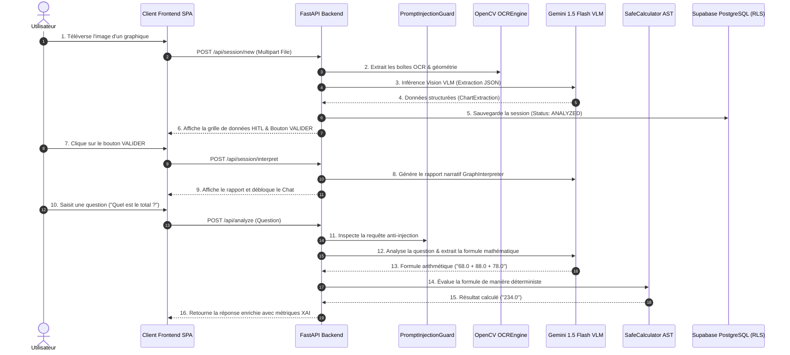
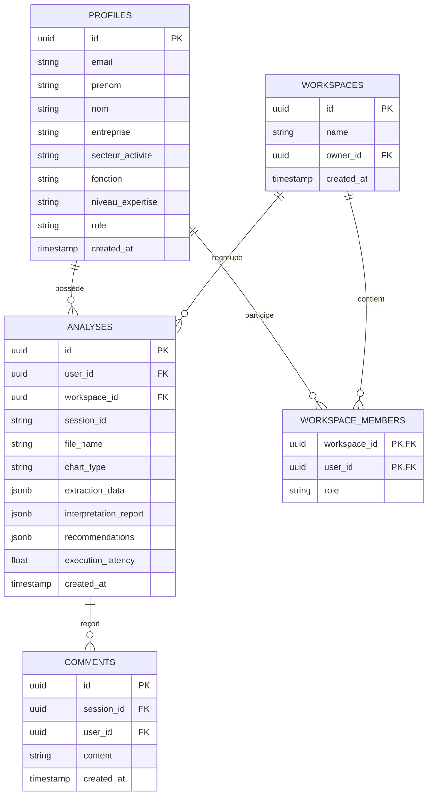

# 🔄 Flux de Données & Pipelines — GraphEin AI

Ce document détaille les flux de données bout-en-bout, la modélisation de la base de données et les pipelines d'exécution multimodaux de **GraphEin AI**.

---

## 📑 Table des Matières
1. [Diagramme de Séquence Général](#1-diagramme-de-séquence-général)
2. [Workflow d'Analyse IA & Multimodal](#2-workflow-danalyse-ia--multimodal)
3. [Schéma de la Base de Données (Mermaid ERD)](#3-schéma-de-la-base-de-données-mermaid-erd)
4. [Politiques de Sécurité Supabase (Row Level Security)](#4-politiques-de-sécurité-supabase-row-level-security)

---

## 1. Diagramme de Séquence Général

Le diagramme suivant illustre le cheminement complet d'une requête utilisateur, du téléversement initial du graphique à la réponse finale.



---

## 2. Workflow d'Analyse IA & Multimodal

```mermaid
flowchart TD
    Start([Image Téléversée]) --> Preprocess[Pré-traitement OpenCV Niveaux de gris / Contours]
    Preprocess --> OCRBoxes[Détection des boîtes englobantes OCR]
    OCRBoxes --> MultiDetect{Planche Multi-Graphiques ?}
    
    MultiDetect -- Oui --> Segment[Segmentation en sous-images par MultiChartDetector]
    MultiDetect -- Non --> SingleImage[Image unique]
    
    Segment --> VLMInference[Inférence Gemini 1.5 Flash Vision]
    SingleImage --> VLMInference
    
    VLMInference --> StructJSON[Structure JSON Pydantic ChartExtraction]
    StructJSON --> HITLDataGrid[Présentation dans la Grille HITL Frontend]
    
    HITLDataGrid --> UserValidate{Utilisateur valide (VALIDER) ?}
    UserValidate -- Non --> HITLEdit[Édition manuelle des valeurs]
    HITLEdit --> HITLDataGrid
    
    UserValidate -- Oui --> Interpret[GraphInterpreter Agent: Génération du Rapport]
    Interpret --> UnlockChat[Déblocage du Chat Utilisateur]
    
    UnlockChat --> UserQuery[Question Utilisateur]
    UserQuery --> GuardCheck{Prompt Conforme ?}
    GuardCheck -- Non --> SecurityAlert[Alerte Sécurité Bloquante]
    GuardCheck -- Oui --> IntentClass[Classification de l'Intention XGBoost/Rules]
    
    IntentClass --> FormulaExtract[Extraction de la Formule par VLM/Rules]
    FormulaExtract --> ASTEval[SafeCalculator AST Engine]
    ASTEval --> FinalOutput[Réponse Finale + Métriques XAI + PDF]
```

---

## 3. Schéma de la Base de Données (Mermaid ERD)



---

## 4. Politiques de Sécurité Supabase (Row Level Security)

Les requêtes vers la base de données PostgreSQL Supabase sont protégées par les politiques RLS suivantes :

```sql
-- Politiques RLS pour la table 'analyses'
ALTER TABLE public.analyses ENABLE ROW LEVEL SECURITY;

-- 1. Lecture : Un utilisateur ne peut lire que ses propres analyses ou celles des workspaces auxquels il appartient
CREATE POLICY "RLS_Select_User_Analyses" ON public.analyses
    FOR SELECT USING (
        auth.uid() = user_id OR
        workspace_id IN (
            SELECT workspace_id FROM public.workspace_members WHERE user_id = auth.uid()
        )
    );

-- 2. Insertion : Un utilisateur ne peut insérer des analyses que pour lui-même
CREATE POLICY "RLS_Insert_User_Analyses" ON public.analyses
    FOR INSERT WITH CHECK (auth.uid() = user_id);
```
