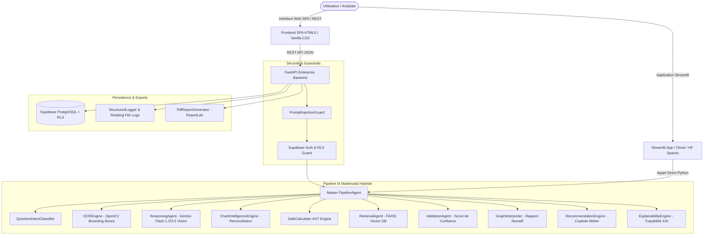

# 📊 GrapheinAI — Plateforme SaaS d'Intelligence Graphique Enterprise & Multimodale

[](https://www.python.org/downloads/release/python-3120/)
[](https://fastapi.tiangolo.com)
[](https://deepmind.google/technologies/gemini/)
[](https://opencv.org/)
[](https://github.com/facebookresearch/faiss)
[](https://supabase.com)
[](Dockerfile)
[]()
[]()

**GrapheinAI** est une plateforme SaaS industrielle d'intelligence graphique multimodale d'entreprise. Elle permet d'extraire, valider, analyser, interpréter et synthétiser automatiquement des données issues de graphiques scientifiques, financiers, industriels et décisionnels (histogrammes, courbes, camemberts, nuages de points et planches multi-graphiques).

Elle combine la vision par ordinateur (**OpenCV OCR**), le raisonnement multimodal par vision-langage (**Gemini 1.5/3.5 Flash Vision**), l'évaluation déterministe par analyseur d'arbre syntaxique (**SafeCalculator AST**), la recherche vectorielle localisée (**FAISS RAG**), un moteur de recommandation métier multi-tenant et des fonctions de travail collaboratif sous **Supabase PostgreSQL avec Row Level Security (RLS)**.

---

## 🌟 Fonctionnalités Clés & Piliers du Système

### 1. 🔍 Extraction Hybride Vision + OCR
- **Segmentation Géométrique Low-Level (OpenCV)** : Détection des contours, découpage des zones de texte, des axes, des graduations et des légendes sous forme de boîtes englobantes `[x, y, w, h]`.
- **Analyse Sémantique VLM (Gemini Flash Vision)** : Compréhension de la structure visuelle, extraction structurée des séries de données et typologie dans un schéma Pydantic strict (`ChartExtraction`, `ExtractedDataPoint`).

### 2. 🎛️ Workflow HITL (Human-in-the-Loop) & Grille d'Édition
- **Grille de Données Interactive** : Interface permettant d'inspecter, corriger et valider les valeurs extraites avant tout traitement analytique.
- **Validation Multi-Critères (`ValidationAgent`)** : Calcul automatique d'un score de confiance global (`VERY_HIGH`, `HIGH`, `MEDIUM`, `LOW`) basé sur l'alignement OCR, le chevauchement géométrique et la plausibilité numérique.

### 3. 🧮 Raisonnement Déterministe Anti-Hallucination (`SafeCalculator AST`)
- **Évaluation Mathématique Sécurisée** : Analyseur d'Arbre Syntaxique Abstrait Python (`ast.parse`) restreint strictement aux opérations arithmétiques autorisées (`+`, `-`, `*`, `/`, `**`) et fonctions statistiques (`min`, `max`, `sum`, `avg`, `abs`, `round`).
- **Zéro Hallucination & Zéro Injection** : Garantie d'exactitude absolue sur les calculs (croissance, ratios, sommes) sans exécuter de code arbitraire (`eval` proscrit).

### 4. ⚡ Routage Intelligent & Recherche Vectorielle (RAG FAISS)
- **Classifier d'Intention (`QuestionIntentClassifier`)** : Catégorisation des requêtes (`CALCULATION`, `STATISTICS`, `DATA_POINT`, `TREND`, `COMPARISON`, `GENERAL_ANALYSIS`).
- **Classifier de Complexité (XGBoost)** : Routage des requêtes simples vers un traitement rapide local et des requêtes complexes vers la chaîne multimodale complète.
- **Indexation Vectorielle (`RetrievalAgent` / FAISS)** : Recherche sous-milliseconde d'exemples de Q&R et de contexte sectoriel via embeddings `sentence-transformers`.

### 5. 📜 Synthèse Scientifique Narrative & Recommandations Métier
- **GraphInterpreter** : Génération automatique d'une synthèse narrative d'une page mettant en valeur les tendances globales, les pics, les minima, les anomalies statistiques et les corrélations.
- **RecommendationEngine** : Recommandations stratégiques et plans d'action personnalisés selon le rôle métier de l'utilisateur (Finance, Santé, Immobilier, Industrie, Tech) et son niveau d'expertise.
- **ExplainabilityEngine (XAI)** : Rapport de transparence explicative détaillant les 10 indicateurs de traçabilité (données utilisées, formules AST évaluées, bribes RAG, temps d'exécution, version du modèle).

### 6. 📄 Exports Officiels PDF & Excel High-Definition
- **Moteur PDF Vectoriel (`pdf_generator.py`)** : Génération instantanée de rapports PDF d'entreprise multi-pages via ReportLab (graphiques, tableaux de données, XAI, recommandations).
- **Export Excel** : Exportation structurée multi-feuilles avec `openpyxl` et `xlsxwriter`.

### 7. 🛡️ Authentification Multi-Tenant & Sécurité SRE
- **Supabase Auth & PostgreSQL RLS** : Authentification par jetons JWT, gestion des espaces de travail partagés (`workspaces`), rôles RBAC (Admin, Analyst, Viewer) et politiques RLS strictes.
- **PromptInjectionGuard** : Filtrage anti-jailbreak, nettoyage HTML/script et validation des en-têtes "magic bytes" des fichiers téléversés (PNG, JPEG, WEBP, PDF).
- **Observabilité & SRE** : Monitoring en temps réel `/health`, `/status`, `/version`, `/metrics`, rotation automatique des logs (`loguru`) et sauvegardes programmées (`scripts/backup_manager.py`).

---

## 🏗 Architecture Globale du Système



---

## 📁 Arborescence du Projet

```
GrapheinAI/
├── app.py                      # Point d'entrée racine (ASGI Uvicorn / Streamlit Launcher)
├── requirements.txt            # Dépendances Python de production
├── pyproject.toml              # Configuration du projet Python & outils
├── Dockerfile                  # Configuration de conteneurisation Docker
├── docker-compose.yml          # Orchestration multi-conteneurs
├── Procfile                    # Configuration de déploiement Heroku/Render
├── render.yaml                 # Manifeste de déploiement PaaS Render
├── .env.example                # Modèle des variables d'environnement
├── README.md                   # Présentation générale du projet
├── Architecture.md             # Spécification technique détaillée & rôles des techno
├── DATAFLOW.md                 # Flux de données, séquences et schéma BD
├── API.md                      # Documentation OpenAPI / REST endpoints
├── INSTALL.md                  # Guide d'installation pas-à-pas
├── USER_GUIDE.md               # Guide d'utilisation utilisateur final
├── ADMIN_GUIDE.md              # Guide d'administration & opérations SRE
├── SECURITY.md                 # Politique de sécurité, sandbox AST & RLS
├── DEPLOYMENT.md               # Guide DevOps & intégration continue
├── src/                        # Code source principal
│   ├── agents/                 # Pipeline d'agents IA spécialisés
│   │   ├── pipeline_agent.py          # Orchestrateur central Master PipelineAgent
│   │   ├── reasoning_agent.py         # Moteur VLM Gemini Flash Vision
│   │   ├── classifier_agent.py        # Classifier XGBoost / complexité
│   │   ├── intent_classifier.py       # Classifier d'intention de question
│   │   ├── safe_calculator.py         # Évaluateur déterministe d'AST Python
│   │   ├── retrieval_agent.py         # Agent de recherche vectorielle FAISS
│   │   ├── validation_agent.py        # Validateur de données & confiance
│   │   ├── graph_interpreter.py       # Générateur de rapports narratifs
│   │   ├── insight_agent.py           # Extracteur d'insights statistiques
│   │   ├── recommendation_engine.py   # Générateur de recommandations métier
│   │   ├── explainability_engine.py   # Moteur de rapports de transparence XAI
│   │   ├── multi_chart_pipeline.py    # Pipeline pour planches multi-graphiques
│   │   ├── multi_chart_fusion.py      # Fusion synthétique multi-figures
│   │   └── conversation_manager.py    # Gestionnaire de mémoire conversationnelle
│   ├── app/                    # Couche API REST & Web
│   │   ├── api.py                     # API REST FastAPI production (60+ KB)
│   │   ├── streamlit_app.py           # Interface Streamlit interactive
│   │   ├── main.py                    # Script de démarrage secondaire
│   │   └── static/                    # Frontend SPA HTML5 / Vanilla CSS / JS
│   ├── models/                 # Modèles de données Pydantic
│   │   ├── chart.py                   # Schémas des graphiques et extractions
│   │   ├── user.py                    # Schémas d'authentification et utilisateurs
│   │   ├── workspace.py               # Schémas des espaces de travail et collaboration
│   │   ├── session.py                 # Schémas des sessions d'analyse
│   │   ├── admin.py                   # Schémas d'administration & métriques
│   │   └── exceptions.py              # Exceptions métier personnalisées
│   ├── services/               # Services métier d'infrastructure
│   │   ├── supabase_service.py        # Client Supabase PostgreSQL & RLS
│   │   ├── collaboration_service.py   # Gestion des workspaces et partage
│   │   ├── session_manager.py         # Gestionnaire de sessions thread-safe
│   │   ├── admin_service.py           # Services d'administration d'entreprise
│   │   ├── cache_manager.py           # Cache hybride LRU & DiskCache
│   │   ├── email_service.py           # Service d'envoi d'emails (Resend / SMTP)
│   │   ├── observability_service.py   # Métriques de santé et SRE
│   │   ├── performance_monitor.py     # Chronométrage précis des étapes
│   │   └── queue_manager.py           # File d'attente des tâches d'arrière-plan
│   ├── utils/                  # Moteurs et utilitaires techniques
│   │   ├── ocr_engine.py              # Segmentation d'image OpenCV & OCR
│   │   ├── chart_intelligence_engine.py# Fusion OpenCV + VLM Gemini
│   │   ├── multi_chart_detector.py    # Détecteur de sous-graphiques multi-panneaux
│   │   ├── pdf_generator.py           # Moteur de rapport PDF ReportLab
│   │   ├── rag_pipeline.py            # Pipeline RAG FAISS & Embeddings
│   │   ├── prompt_builder.py          # Constructeur dynamique de prompts LLM
│   │   ├── security_guard.py          # Garde-fou anti-injection & validation fichiers
│   │   ├── stat_calculator.py         # Moteur de calculs statistiques exacts
│   │   ├── anomaly_detector.py        # Détecteur d'anomalies statistiques (Z-score/IQR)
│   │   ├── data_engineering.py        # Nettoyage et transformation de données
│   │   └── structured_logger.py       # Configuration des logs Loguru
│   └── i18n/                   # Internationalisation (Français / Anglais)
│       └── language_manager.py        # Dictionnaire & détection automatique de langue
├── supabase/                   # Définitions de base de données
│   └── schema.sql                 # Schéma PostgreSQL, tables, index et politiques RLS
├── scripts/                    # Scripts d'automatisation
│   ├── backup_manager.py          # Gestionnaire de sauvegardes automatiques
│   └── generate_soutenance_pdf.py # Générateur du dossier de présentation
└── tests/                      # Suite de tests automatisés (28 fichiers de test)
```

---

## 🚀 Prise en Main Rapide (< 5 minutes)

### Prérequis
- **Python** 3.12 ou supérieur
- Une clé API **Google Gemini** (`GEMINI_API_KEY`)
- *(Optionnel)* Un projet **Supabase** (URL + Clé Anonyme / Service Role) pour l'authentification et les workspaces.

---

### Option A : Déploiement Local Standard

```bash
# 1. Cloner le dépôt
git clone https://github.com/your-org/GrapheinAI.git
cd GrapheinAI

# 2. Créer et activer l'environnement virtuel
python -m venv venv
# Sur Linux/macOS :
source venv/bin/activate
# Sur Windows :
venv\Scripts\activate

# 3. Installer les dépendances Python
pip install -r requirements.txt

# 4. Configurer le fichier d'environnement (.env)
cp .env.example .env
# Éditer .env et renseigner GEMINI_API_KEY=votre_clé_api

# 5. Démarrer le serveur backend FastAPI
python -m uvicorn src.app.api:app --host 127.0.0.1 --port 8088 --reload
```

- 🌐 **Interface Web SPA** : [http://127.0.0.1:8088](http://127.0.0.1:8088)
- 📚 **Documentation Swagger API** : [http://127.0.0.1:8088/docs](http://127.0.0.1:8088/docs)

---

### Option B : Lancement de l'Application Streamlit

Pour utiliser l'interface interactive Streamlit :

```bash
streamlit run app.py
```

- 🎈 **URL Streamlit** : [http://localhost:8501](http://localhost:8501)

---

### Option C : Déploiement via Docker & Docker-Compose

```bash
# Construire et démarrer le conteneur Docker en arrière-plan
docker-compose up -d --build

# Consulter les logs de l'application
docker-compose logs -f
```

---

## 🧪 Tests Automatisés & Assurance Qualité

Le projet inclut une suite de tests unitaires et d'intégration complète couvrant les pipelines, les agents, le calculateur AST, la sécurité et la base de données.

```bash
# Exécuter l'ensemble des tests pytest
pytest

# Exécuter les tests avec affichage détaillé
pytest -v --tb=short
```

---

## 📚 Matrice de la Documentation Technique

| Fichier | Objet et Contenu |
| :--- | :--- |
| 🏗️ [**Architecture.md**](Architecture.md) | **Spécification Technique & Rôles des Technologies** : Analyse détaillée de chaque technologie, particularité, utilité et architecture des agents. |
| 🔄 [**DATAFLOW.md**](DATAFLOW.md) | **Flux de Données & Séquences** : Diagrammes de séquence UML, cycle de vie d'une requête et modèles de persistance. |
| 🔌 [**API.md**](API.md) | **Référence des API REST** : Documentation des 25+ endpoints FastAPI, formats JSON et codes d'erreur HTTP. |
| ⚙️ [**INSTALL.md**](INSTALL.md) | **Guide d'Installation** : Procédure détaillée pour l'installation en local, Docker, Streamlit Cloud et PaaS. |
| 📖 [**USER_GUIDE.md**](USER_GUIDE.md) | **Guide Utilisateur Final** : Tutoriel pas-à-pas pour la téléversement, l'édition HITL et la génération de rapports PDF. |
| 🛠️ [**ADMIN_GUIDE.md**](ADMIN_GUIDE.md) | **Guide d'Administration** : Gestion des utilisateurs RBAC, quotas API, sauvegardes et supervision SRE. |
| 🔒 [**SECURITY.md**](SECURITY.md) | **Politique de Sécurité** : Sandboxing AST, politiques PostgreSQL RLS, garde-fous anti-injection et gestion des jetons JWT. |
| 🚀 [**DEPLOYMENT.md**](DEPLOYMENT.md) | **Guide DevOps & Production** : Configurations Nginx, SSL, Docker, Render, Heroku et stratégies de scale. |

---

## 🌿 Responsabilité Éthique, RGPD & Sobriété Numérique

- **Eco-Conception par Routage Intelligent** : L'utilisation prioritaire de l'AST `SafeCalculator`, des calculs statistiques en C++/Python et du RAG FAISS local permet d'éviter l'envoi de requêtes répétitives aux LLM cloud, réduisant l'empreinte carbone jusqu'à 75%.
- **Conformité RGPD & Protection des Données** : Aucune donnée confidentielle ou médicale téléversée n'est utilisée pour le ré-entraînement de modèles publics. L'isolation multi-tenant est garantie par les règles PostgreSQL RLS.
- **Sobriété Frontend** : L'interface SPA est construite en HTML5/Vanilla CSS sans framework JS lourd, garantissant un poids de bundle minimal et un rendu sous-secondaire.

---

## 📄 Licence & Propriété

Copyright © 2026 **GrapheinAI Team**. Tous droits réservés.  
Logiciel sous licence propriétaire SaaS Enterprise.
