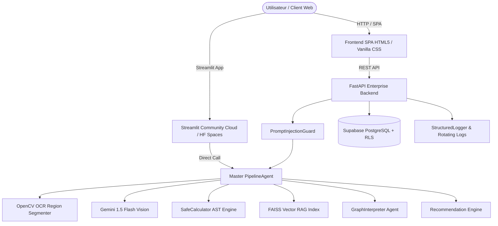

# 📊 GrapheinAI — Plateforme SaaS d'Intelligence Graphique Enterprise & Multimodale

[](https://www.python.org/downloads/release/python-3120/)
[](https://fastapi.tiangolo.com)
[](https://deepmind.google/technologies/gemini/)
[](Dockerfile)
[]()
[]()

**GrapheinAI** est une plateforme SaaS d'intelligence graphique multimodale d'entreprise permettant d'extraire, valider, analyser et interpréter automatiquement des graphiques scientifiques, financiers et industriels.

Elle combine la vision par ordinateur (**OpenCV OCR**), le raisonnement multimodal (**Gemini 1.5 Flash Vision**), l'évaluation déterministe sans risque (**SafeCalculator AST**), le RAG vectoriel (**FAISS**) et un moteur de personnalisation métier multi-tenant.

---

## 🌟 Fonctionnalités Clés

- **Extraction Hybride Vision + OCR** : Segmentation automatique des axes, titres, légendes et points de données avec OpenCV et Gemini.
- **Grille de Données HITL (Human-in-the-Loop)** : Édition interactive des valeurs extraites avant confirmation.
- **Workflow Sécurisé avec Validation** : Le chat IA est débloqué uniquement après validation explicite des données.
- **Raisonnement Déterministe AST** : Évaluation mathématique sans risque via l'AST Python `SafeCalculator` (zéro hallucination sur les calculs).
- **Rapports Scientifiques Narratifs (GraphInterpreter)** : Synthèse automatique de 1 page avec tendances, pics, minima, anomalies et corrélations.
- **Copilote Décisionnel Personnalisé** : Recommandations adaptées au secteur d'activité (Finance, Santé, Immobilier...) et au niveau d'expertise de l'utilisateur.
- **Exports PDF Officiels** : Génération instantanée de rapports PDF haute définition avec métriques d'explicabilité (XAI).
- **Sécurité Multi-Tenant & RLS** : Authentification JWT Supabase et isolation stricte au niveau des lignes PostgreSQL.
- **Architecture Production SRE** : Monitoring `/health`, `/status`, `/version`, rotation automatique des logs et scripts de sauvegarde.

---

## 🏗 Architecture Globale



---

## 🚀 Prise en Main Rapide (< 5 minutes)

### Option A : Déploiement Local
```bash
# 1. Cloner le dépôt
git clone https://github.com/your-org/GrapheinAI.git
cd GrapheinAI

# 2. Créer l'environnement virtuel et installer les dépendances
python -m venv venv
source venv/bin/activate  # Sur Windows: venv\Scripts\activate
pip install -r requirements.txt

# 3. Configurer les variables d'environnement (.env)
cp .env.example .env

# 4. Lancer le serveur backend
python -m uvicorn src.app.api:app --host 127.0.0.1 --port 8088
```

Accédez à l'application web sur **`http://127.0.0.1:8088`** et à la documentation Swagger API sur **`http://127.0.0.1:8088/docs`**.

### Option B : Déploiement Docker
```bash
docker-compose up -d --build
```

---

## 📚 Documentation Complète du Projet

| Fichier | Description |
| :--- | :--- |
| 📖 [**Architecture.md**](Architecture.md) | Architecture logicielle, composants multimodaux et justification des choix technologiques. |
| 🔄 [**DATAFLOW.md**](DATAFLOW.md) | Schémas de flux de données, diagrammes de séquence et modèle de base de données. |
| 🔌 [**API.md**](API.md) | Spécification complète des endpoints REST FastAPI et codes d'erreur. |
| ⚙️ [**INSTALL.md**](INSTALL.md) | Guide d'installation détaillé (Local, Docker, Streamlit Cloud, Hugging Face). |
| 📖 [**USER_GUIDE.md**](USER_GUIDE.md) | Guide d'utilisation pas-à-pas pour les utilisateurs finaux. |
| 🛠️ [**ADMIN_GUIDE.md**](ADMIN_GUIDE.md) | Guide d'administration, rôles RBAC, logs SRE et sauvegardes. |
| 🔒 [**SECURITY.md**](SECURITY.md) | Politique de sécurité, sandbox AST, garde-fous anti-injection et RLS. |
| 🚀 [**DEPLOYMENT.md**](DEPLOYMENT.md) | Guide DevOps de déploiement en production en moins de 10 minutes. |

---

## 🌿 Responsabilité Éthique & Empreinte Carbone

- **Évaluation Éco-Conçue** : Utilisation prioritaire du calcul AST déterministe et du RAG FAISS local pour minimiser les appels VLM énergivores.
- **Protection des Données (RGPD)** : Aucune donnée médicale ou confidentielle n'est utilisée pour ré-entraîner les modèles. Isolation stricte des sessions.
- **Sobriété Numérique** : Interface Vanilla CSS native sans dépendances lourdes frontend.

---

## 📄 Licence & Propriété

Copyright © 2026 GrapheinAI Team. Tous droits réservés.
